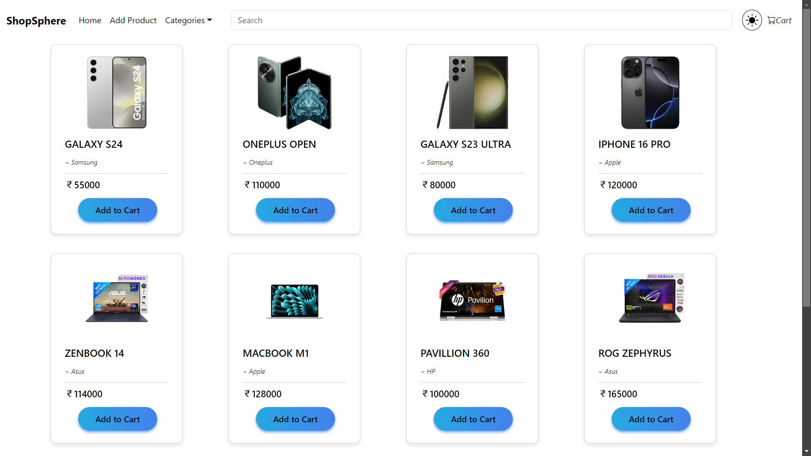
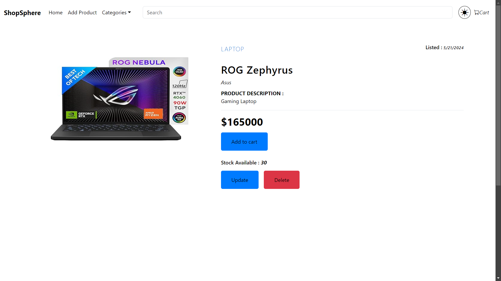
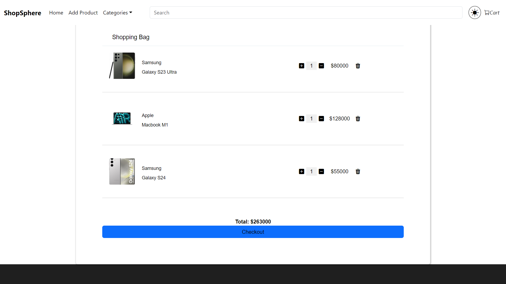
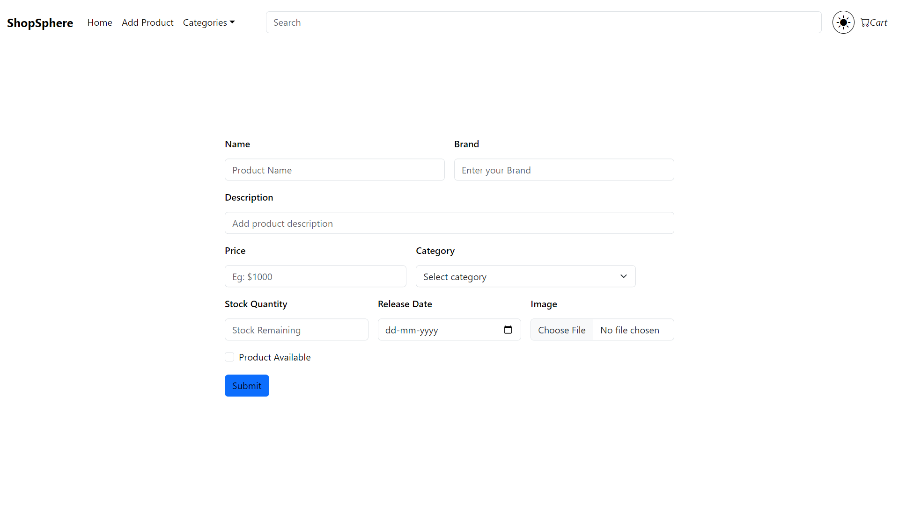

# ShopSphere

ShopSphere is an e-commerce web application that allows users to browse, search, add, update, and delete products. The application is built using Spring Boot for the backend and React for the frontend.

## Table of Contents

- [Features](#features)
- [Technologies Used](#technologies-used)
- [Backend API](#backend-api)
- [Frontend](#frontend)
- [Installation](#installation)
- [Usage](#usage)
- [Contributing](#contributing)
- [License](#license)

## Features

- View all products and product details.
- Add new products with images.
- Update existing product information.
- Delete products from the inventory.
- Search for products by keywords.

## Technologies Used

- **Backend**: Spring Boot, Java, JPA, Hibernate, Maven
- **Frontend**: React, Axios, React Router, HTML, CSS, Javascript, Vite
- **Database**: H2 Database, SQL
- **Image Upload**: MultipartFile for handling images

## Frontend

The frontend is built using React and communicates with the backend via Axios. The UI is designed for ease of use, allowing users to navigate through product listings and manage their cart effectively.

## Backend API

The backend API exposes various endpoints for product management. Below are the key endpoints:

- `GET /api/products`: Retrieve all products.
- `GET /api/product/{id}`: Retrieve a product by ID.
- `POST /api/product`: Add a new product (requires product details and an image).
- `PUT /api/product/{id}`: Update an existing product (requires updated product details and image).
- `DELETE /api/product/{id}`: Delete a product by ID.
- `GET /api/products/search`: Search for products by keyword.

## Installation

### Backend

1. Clone the repository:

   ```bash
      git clone https://github.com/dhanushkorada/Shopsphere.git
      cd Shopsphere
   ```
2. Navigate to the backend directory:

  ```bash
     cd backend
  ```
3. Run the Spring Boot application:

   ```bash
      mvn spring-boot:run
   ```

### Frontend

1. Navigate to the Frontend directory::
   
   ```bash
     cd backend
   ```
2. Install dependencies:

   ```bash
      npm install
   ```
3. Start the React application:

   ```bash
      npm run dev
   ```

## Usage

Once both the backend and frontend are running, you can access the application at http://localhost:5173 (Vite app) and interact with the e-commerce features.

## Application Preview

Take a look at some screenshots showcasing key features and pages of the application

### 1. Home Page
A welcoming interface where users can browse available products.


### 2. Product Details Page
Detailed view of a selected product with options to add it to the cart.


### 3. Shopping Cart
Overview of items added to the cart with the ability to proceed to checkout.


### 3. Add new product
List of details to be filled for adding a new product.

